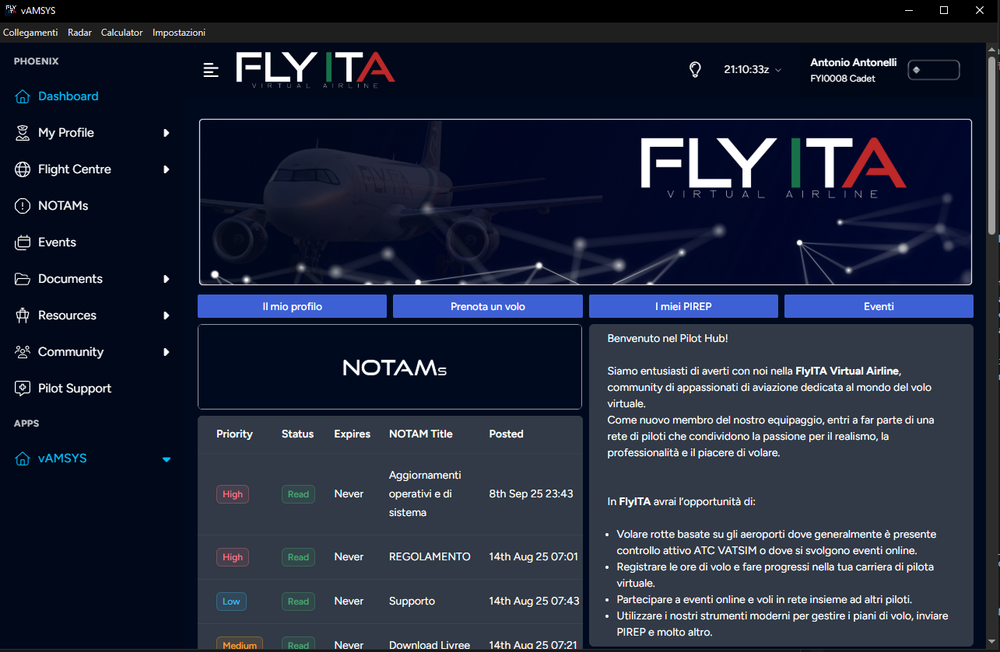
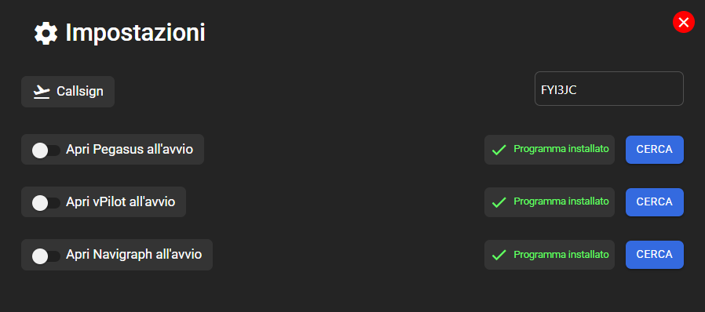
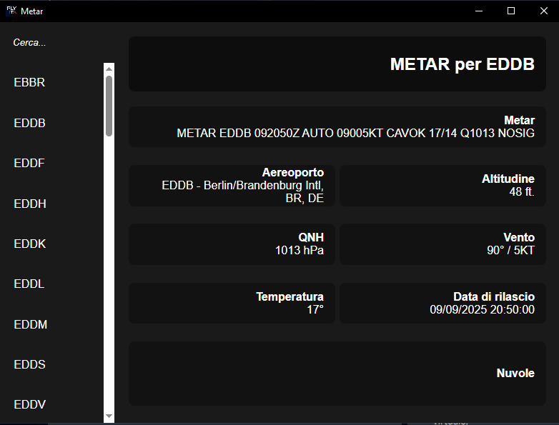

# FlyITA Pilot Hub (README)

FlyITA Pilot Hub is a desktop helper application for a Microsoft Flight Simulator virtual airline. It integrates with VAMSYS/VATSIM to track pilot logins/logouts, helps manage flights and bookings, and can optionally launch companion apps (Pegasus, vPilot, Navigraph) at startup.

## Key features
- VATSIM integration to monitor pilot presence and flight plans via [`VATSIMCheck`](vatsimcheck.js).
- Start companion tools on launch and detect installed programs (`Pegasus`, `vPilot`, `Navigraph`) via [`isProgramInstalled`](main.js).
- In-app settings UI to set callsign, choose manual executables, and toggle startup options ([settings.html](settings.html)).
- METAR viewer with a small airports database ([metar.html](metar.html)).
- Splash screen and polished menu integration ([splash.html](splash.html) and [main.js](main.js)).
- Automatic update support via [`checkForUpdates`](updater/autoUpdater.js).
- Secure renderer-main IPC bridge in [preload.js](preload.js) and handlers in [`IPC`](handlers/ipc.js).

## Packaging / Distribution
- Build and publish is configured with electron-builder. See [electron-builder.json](electron-builder.json) and the `dist` script in [package.json](package.json).
- Pre/post build obfuscation hooks are implemented in [scripts/beforeBuild.cjs](scripts/beforeBuild.cjs) and [scripts/afterBuild.cjs](scripts/afterBuild.cjs).

## Important files & symbols
- Launcher and app lifecycle: [main.js](main.js) — see functions like [`executeProgram`](main.js), [`programNameFromPath`](main.js), and [`isProgramRunning`](main.js).
- VATSIM monitor/class: [`VATSIMCheck`](vatsimcheck.js).
- IPC and dialogs: [`IPC`](handlers/ipc.js) and [preload.js](preload.js).
- Utilities: [`convertImage`](utils/functions.js) and variables in [utils/variables.js](utils/variables.js).
- Updater: [updater/autoUpdater.js](updater/autoUpdater.js).
- UI: [settings.html](settings.html), [metar.html](metar.html), [splash.html](splash.html).

## How it uses VAMSYS/VATSIM
The app fetches live VATSIM datasets to detect pilot login/logout events, extract flight plans, aircraft, and radio info. The [`VATSIMCheck`](vatsimcheck.js) class polls the VATSIM data feed, constructs flight summaries, and can send notifications (e.g., webhooks) when specific events occur.

## Usage notes
- Callsign is stored via `electron-store` ([package.json](package.json) dependency). Settings are validated at close of the settings window ([handlers/ipc.js](handlers/ipc.js)).
- Manual selection of executables stores a startup path and a flag (see [main.js](main.js) and [handlers/ipc.js](handlers/ipc.js)).
- METAR uses a CORS proxy at the moment (see [metar.html](metar.html) AJAX calls).

## Gallery

Aggiungi tre immagini nella cartella `assets/images` (o modifica i percorsi qui sotto se le metti altrove).

## License
Check repository settings / author in [package.json](package.json) for license and author details.
